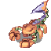
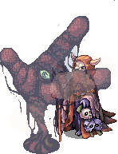
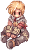
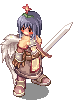
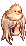
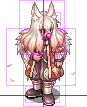

# zrenderer

Tool to render sprites from the game Ragnarok Online. This tool is available as either a webservice or as a CLI tool.

##### Table of contents
* [Required Resources](#required-resources)
* [Usage](#usage)
  * [CLI](#cli)
    * [Example](#example)
  * [Server](#server)
* [Docker](#docker)
* [Dependencies when building](#dependencies-when-building)
  * [Linux](#linux)
  * [Windows](#windows)
* [Building](#building)
  * [CLI](#cli-1)
  * [Server](#server-1)
  * [Extra step for Windows](#extra-step-for-windows)

## Required Resources
Please see [RESOURCES.md](https://github.com/zhad3/zrenderer/blob/main/RESOURCES.md).

## Usage
### CLI
`./zrenderer -h`
```
A tool to render sprites from Ragnarok Online
-c                --config Specific config file to use instead of the default. Default: zrenderer.conf
-o                --outdir Output directory where all rendered sprites will be saved to. Default: output
            --resourcepath Path to the resource directory. All resources are tried to be found within this directory. Default: 
-j                   --job Job id(s) which should be rendered. Can contain multiple comma separated values. Default: 
-g                --gender Gender of the player character. Possible values are: 'male' (1) or 'female' (0). Default: male
                    --head Head id which should be used when drawing a player. Default: 1
                  --outfit The alternative outfit for player characters. Not all characters have alternative outfits. In these cases the default character will be rendered instead. Value of 0 means no outfit. Default: 0
                --headgear Headgears which should be attached to the players head. Can contain up to 3 comma separated values. Default: 
                 --garment Garment which should be attached to the players body. Default: 0
                  --weapon Weapon which should be attached to the players body. Default: 0
                  --shield Shield which should be attached to the players body. Default: 0
-a                --action Action of the job which should be drawn. Default: 0
-f                 --frame Frame of the action which should be drawn. Set to -1 to draw all frames. Default: -1
             --bodyPalette Palette for the body sprite. Set to -1 to use the standard palette. Default: -1
             --headPalette Palette for the head sprite. Set to -1 to use the standard palette. Default: -1
                 --headdir Direction in which the head should turn. This is only applied to player sprites and only to the stand and sit action. Possible values are: straight, left, right or all. If 'all' is set then this direction system is ignored and all frames are interpreted like any other one. Default: all
            --madogearType The alternative madogear sprite for player characters. Only applicable to madogear jobs. Possible values are 'robot' (0) and 'suit' (2). Default: robot
            --enableShadow Draw shadow underneath the sprite. Default: true
            --singleframes Generate single frames of an animation. Default: false
   --enableUniqueFilenames If enabled the output filenames will be the checksum of input parameters. This will ensure that each request creates a filename that is unique to the input parameters and no overlapping for the same job occurs. Default: false
     --returnExistingFiles Whether to return already existing sprites (true) or always re-render it (false). You should only use this option in conjuction with 'enableUniqueFilenames=true'. Default: false
                  --canvas Sets a canvas onto which the sprite should be rendered. The canvas requires two options: its size and an origin point inside the canvas where the sprite should be placed. The format is as following: <width>x<height>±<x>±<y>. An origin point of +0+0 is equal to the top left corner. Example: 200x250+100+125. This would create a canvas and place the sprite in the center. Default: 
            --outputFormat Defines the output format. Possible values are 'png' (0) or 'zip' (1). If zip is chosen the zip will contain png files. Default: png
                --loglevel Log level. Defines the minimum level at which logs will be shown. Possible values are: all, trace, info, warning, error, critical, fatal or off. Default: info
                   --hosts Hostnames of the server. Can contain multiple comma separated values. Default: localhost
                    --port Port of the server. Default: 11011
                 --logfile Log file to write to. E.g. /var/log/zrenderer.log. Leaving it empty will log to stdout. Default: 
               --tokenfile Access tokens file. File in which access tokens will be stored in. If the file does not exist it will be generated. Default: accesstokens.conf
              --enableCORS Setting this to true will add CORS headers to all responses as well as adding an additional OPTIONS route that returns the CORS headers. Default: false
         --allowCORSOrigin Comma separated list of origins that are allowed access through CORS. Set this to a single '*' to allow access from any origin. Example: https://example.com. Default: 
               --enableSSL Whether to use TLS/SSL to secure the connection. You will also need to set the certificate and private key when enabling this setting. We recommend not enabling this feature but instead use a reverse proxy that handles HTTPS for you. Default: false
    --certificateChainFile Path to the certificate chain file used by TLS/SSL. Default: 
          --privateKeyFile Path to the private key file used by TLS/SSL. Default: 
-h                  --help This help information.
```
Options _hosts_, _port_, _logfile_ and _tokenfile_ are ignored for the CLI tool.
### Example
If not otherwise specified the requested sprites will be renderered as an APNG animation of the first action (0, Stand).

**Render monster with id 1001 (Scorpion) with action 0 (Stand, default)**  
`./zrenderer --job=1001`  
Result: 

**Render frame 10 of the monster with id 1870 (Necromancer) of action 16 (Attack)**  
`./zrenderer --job=1870 --action=16 --frame=10`  
Result: 

**Render character with id 4012 (Sniper), action 17 (Sit) while looking to the left (indicated by frame 2)**  
`./zrenderer --job=4012 --action=17 --frame=2`  
Result: 

**Render character with id 1 (Swordman), action 32 (Ready) with headgears 4 (Flower), 125 (Blush), garment 1 (Wings), weapon 1 (Sword), head 4 and gender female.**  
`./zrenderer --job=1 --headgear=4,125 --garment=1 --weapon=2 --head=4 --gender=female --action=32`  
Result: 

**Render character with id 0 (Novice), action 93 (Attack) with garment 1 (Wings), weapon 1 (Sword), head 15, gender male**  
**and place the sprite in a canvas of size 200x200px at x=75 and y=175.**  
`./zrenderer --job=0 --head=15 --bodyPalette=1 --weapon=2 --garment=1 --gender=male --action=93 --canvas=200x200+75+175`  
Result:

| Image border |
| --- |
|  |

**Render only the head of a player: Action 7 (Stand) with head 18, headgear 311 (Baby Chick), palette 3, gender female and look straight.**  
`./zrenderer --job=none --action=7 --head=18 --headgear=311 --headPalette=3 --gender=female`  
Result: 


If you're wondering how these IDs get mapped to the actual sprites take a look at [RESOLVER.md](RESOLVER.md).
## Server
`./zrenderer-server -h`
```
Same as CLI
```
The server will listen on the _hosts_, bind to _port_, write its logs to _logfile_ and read the access tokens from the _tokenfile_.

When running the server for the first time and no access token file has been specified the server will automatically generate one
and print the token to the console. You will need that token to make requests to the server.

You can find the openApi specifications here: [OpenAPI specifications](https://github.com/zhad3/zrenderer/tree/main/server/api-spec).

And documentation here: https://github.com/zhad3/zrenderer/tree/main/server/api-doc.  
The html can be viewed directly here: https://z0q.neocities.org/ragnarok-online-tools/zrenderer/api/

## Docker
You can use the pre-built and published images to run the server.

In a terminal run the following command to get up and running:

```
docker run -d --name zrenderer \
  -v ./zrenderer.docker.conf:/zren/zrenderer.conf \
  -v ./output:/zren/output \
  -v ./my-resources:/zren/resources \
  -p 11011:11011 \
  zhade/zrenderer:latest
```

You will need to provide three directory/files:
- A configuration file (see the example `zrenderer.docker.conf`)
- The output directory where the server will store the images
- The resource directory where all the assets from Ragnarok Online reside in

## Dependencies when building
When building for the first time libpng and lua5.1 will be compiled which require a c-compiler.

## Linux
`gcc`, `binutils`, `autoconf`, `libtool`, `zlib`, `openssl`.

When available choose the dev versions of the packages.

#### OpenSSL 3.x.x
If you are using `openssl version 1.x.x` and receive errors try to downgrade `vibe-d`.

Modify `/server/dub.json`
and downgrade the version to 0.9.3:
```diff
"dependencies": {
    "zconfig": "~>1.0",
    "libpng-apng": "~>1.0",
    "luad": {"path": "../LuaD/"},
    "zencoding:windows949": "~>1.0",
-   "vibe-d:http": "==0.9.6"
+   "vibe-d:http": "==0.9.3"
},
```
Make sure to delete the existing `dub.selections.json` and try to rebuild.
```
$ rm /server/dub.selections.json
$ dub build :server
```

## Windows
[Build Tools for Visual Studio](https://visualstudio.microsoft.com/downloads/#build-tools-for-visual-studio-2019)

## Building
First clone the repository:  
Run:  
```
git clone https://github.com/zhad3/zrenderer.git
cd zrenderer
git submodule update --init
```

Then you can build the CLI and the Server using `dub`.

The automatic releases are build using LDC2. DMD seems to have issues linking (at least on Windows).  
You can download LDC2 binaries on their Github: https://github.com/ldc-developers/ldc/releases

### CLI
Run `dub build --compiler=ldc2 :cli`.  
Release build:  
Run `dub build --compiler=ldc2 --build=release :cli`.  
### Server
Run `dub build --compiler=ldc2 :server`.  
Release build:  
Run `dub build --compiler=ldc2 --build=release :server`.

To add outlines to the sprites boxes for debugging purposes add `--debug=outline` to the build command:  
`dub build --compiler=ldc2 --debug=outline :cli`

Example output:  


### Extra step for Windows:
The above commands must be executed in the [Visual Studio Developer Command Prompt](https://docs.microsoft.com/en-us/visualstudio/ide/reference/command-prompt-powershell)
which will be available when installing the Build Tools for Visual Studio (see above).

Depending on your system the command prompt will be available for x86 and x64. Whichever you choose will build zrenderer for the same architecture.

---
All Ragnarok Online related media and content are copyrighted © by Gravity Co., Ltd & Lee Myoungjin(studio DTDS) and have all rights reserved.

